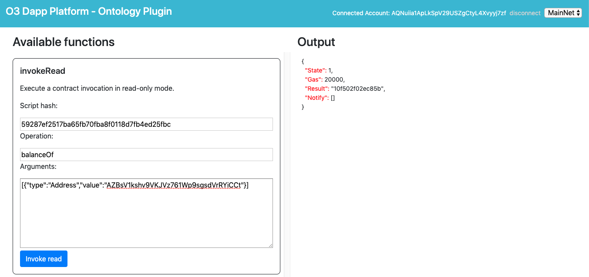
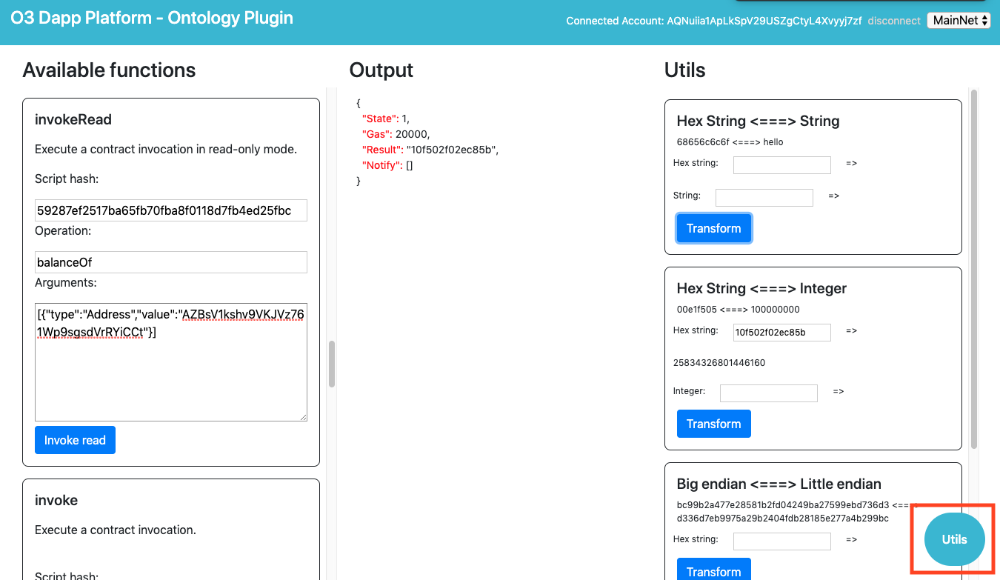
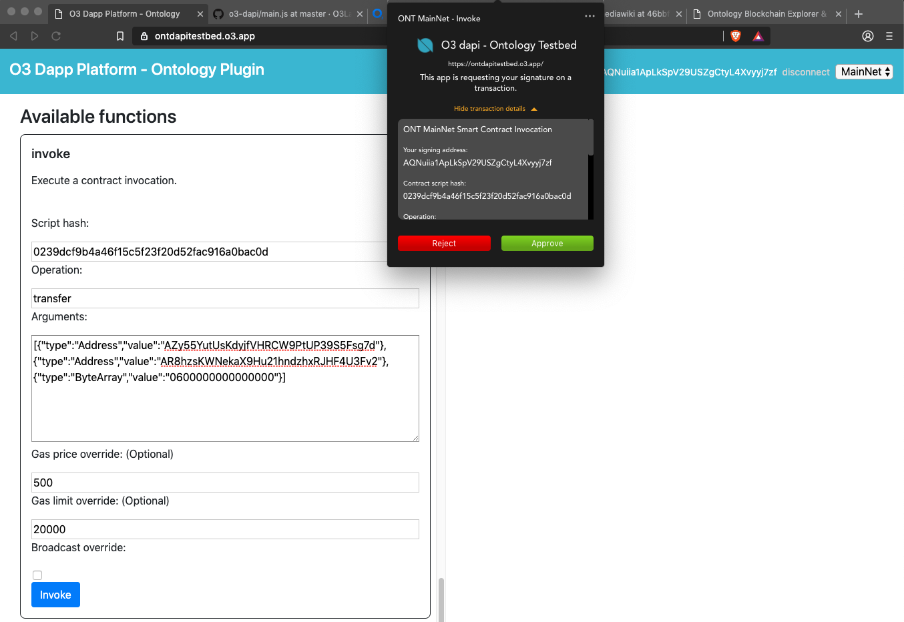

# dAPI Smart Contract Methods

<iframe width="560" height="315" src="https://www.youtube.com/embed/Ne0RyOiXlOY" frameborder="0" allow="accelerometer; autoplay; encrypted-media; gyroscope; picture-in-picture" allowfullscreen></iframe>


One of the most commonly used operations required by a dApp are to be able to interact with smart contracts on the blockchain. These interactions can be condensed into two basic methods, one for reading the output of a invoking a smart contract without writing the results to the chain, and the other for actually having the transaction included in a block on chain to update state.

## Read Invoke

The dAPI provides a read method called `invokeRead`, which will allow you to call a method on a smart contract, and read the results of it's execution. It is a common practice for some smart contract to be written with methods whose sole intent is to be called by `invokeRead`, as there is no information to be written on chain as a result of invoking it, but rather it returns information from storage or calculated values. Otherwise, this method can also be used as a pre-invocation of a method that you intent to invoke normally to change the state of the blockchain. In this way, you can read back the result of a potential future execution.

In order to call this method in the testbed, you can scroll down to the `invokeRead` section.

Here you can fill out:
- `Script Hash`: the hash address of the smart contract which you would like to call
- `Operation`: the method on the smart contract your would like to run
- `Arguments`: input arguments to the method you are calling on the smart contract. Formatted as an array of Argument objects, which have type and value parameters.



If you want to find some contracts to play around with calling `invokeRead` you can have a look at the explorer, use a OEP4 contract hash, and check the `balanceOf` method for different addresses.
[https://explorer.ont.io/token/list/oep4/10/1](https://explorer.ont.io/token/list/oep4/10/1)

In this example we took a random token contract and a random address to test the `balanceOf` method using `invokeRead`. You will find the output of the method in the response object, under `Result`. Notice that the result looks not like we were expecting. This is because all values returned are hex strings, and we need to convert them to be human readable. The testbed provides a utils interface that you can open up by clicking the `Utils` button on the bottom right hand corner of the test bed. Since we are expecting a number to be returned, we can use the `Hex String <===> Integer` converter by pasting the result value into the `Hex string` box and clicking `Transform`. As shown below.



It's also important to note that even after converting the number from a hex string, the number looks very large. This is because smart contracts only deal with whole number, and you will need to further transform the value on the client side by calling the `decimals` method on this same OEP4 contract. Try to call the `decimals` method on the same contract on your own to calculate the total.

In order to call this method, we can find it in the `ONT` sub-namespace `sc`. Since it is a read method, we do not need the users permission to get a result back from this method.  One of the most important things when starting to interact with your smart contract with either `invokeRead` or `invoke`, is how to properly format your imput arguments. Make sure to use the appropriate `type` for each argument.

```typescript
o3dapi.ONT.sc.invokeRead({
  network: 'MainNet',
  scriptHash: '59287ef2517ba65fb70fba8f0118d7fb4ed25fbc',
  operation: 'balanceOf',
  args: [
    {
      type: 'Address',
      value: 'AZy55YutUsKdyjfVHRCW9PtUP39S5Fsg7d'
    }
  ]
})
.then(({ Result }: InvokeReadOutput) => {
  console.log('Invoke read success!');
  console.log('Result: ' + Result);
})
.catch(({type: string, description: string, data: any}) => {
  switch(type) {
    case NO_PROVIDER:
      console.log('No provider available.');
      break;
    case RPC_ERROR:
      console.log('There was an error when broadcasting this transaction to the network.');
      break;
  }
});
```
[Testbed example code](https://github.com/O3Labs/o3-dapi/blob/master/packages/ont/test/main.js#L262)


## Invoke

If your dApp needs to invoke a method in a smart contract that will change the state of the data in the contract, then you will need to call the `invoke` method. While similar in call signature to the `invokeRead` method, this is considered a "write" method, and will prompt the end user to sign and broadcast the transaction to be included in the next block.

From the testbed, you can further experiment with this method and making contract invocations on OEP4 contracts, using the `transfer` operation. Upon calling the `invoke` function by clicking the `Invoke` button, the user will be prompted in a notification to review the details of your smart contract invocation request. Upon review the details and confirming the transaction, it will be broadcast to the Ontology blockchain to be processed in the next block. After confirming and broadcasting, the wallet provider will return the transaction id and node that the transaction was broadcast to to the dApp in the response to the resolution of the return promise.



This method can also be found in the `ONT` sub-namespace `sc`.

```typescript
o3dapi.ONT.sc.invoke({
  network: 'MainNet',
  scriptHash: '59287ef2517ba65fb70fba8f0118d7fb4ed25fbc',
  operation: 'transfer',
  args: [
    {
      type: 'Address',
      value: 'AZy55YutUsKdyjfVHRCW9PtUP39S5Fsg7d'
    },
    {
      type: 'Address',
      value: 'AR8hzsKWNekaX9Hu21hndzhxRJHF4U3Fv2'
    },
    {
      type: 'ByteArray',
      value: '0600000000000000'
    }
  ]
})
.then(({txid, nodeUrl}: SendOutput) => {
  console.log('Send transaction success!');
  console.log('Transaction ID: ' + txid);
  console.log('RPC node URL: ' + nodeUrl);
})
.catch(({type: string, description: string, data: any}) => {
  switch(type) {
    case NO_PROVIDER:
      console.log('No provider available.');
      break;
    case SEND_ERROR:
      console.log('There was an error when broadcasting this transaction to the network.');
      break;
    case MALFORMED_INPUT:
      console.log('The receiver address provided is not valid.');
      break;
    case CANCELED:
      console.log('The user has canceled this transaction.');
      break;
    case INSUFFICIENT_FUNDS:
      console.log('The user has insufficient funds to execute this transaction.');
      break;
  }
});
```
[Testbed example code](https://github.com/O3Labs/o3-dapi/blob/master/packages/ont/test/main.js#L278)
