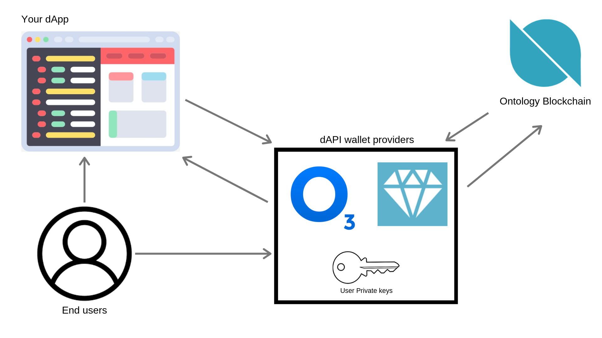
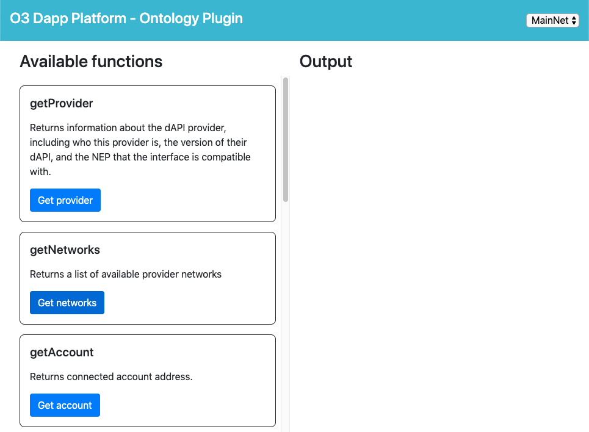
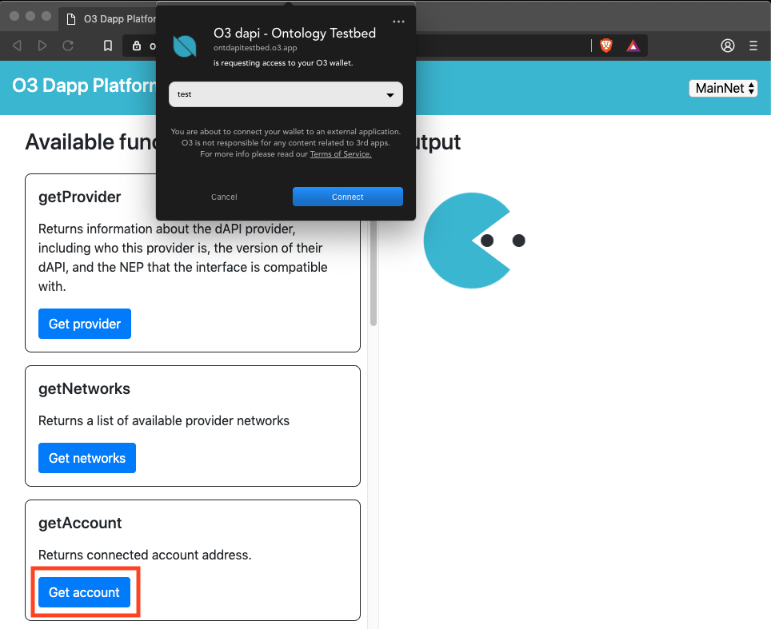
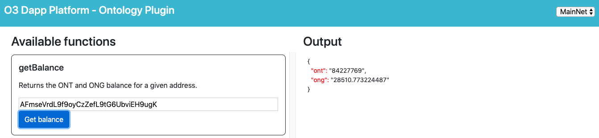
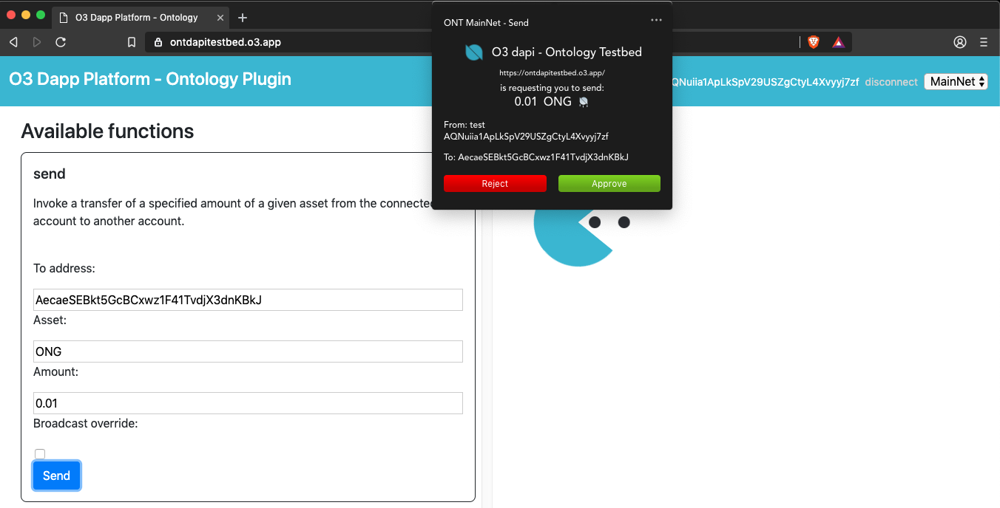

# Intro to creating web based dApps

For all web based applications looking to interact with the Ontology blockchain, it is best advised to utilize a dAPI (decentralized API) provider. These providers are existing wallets which expose a standard API to web based applications in order to fetch data from the Ontology blockchain, to request signatures from a users wallet, and to broadcast transactions to the blockchain.

The benefit to using a wallet provider that supports the dAPI is that the developer of the application is provided with a simplified interface for all interactions, and more importantly does not have to worry about managing the users private key in a secure fashion. By offloading the responsibility of private key management, dApp developer don't have to worry about users not trusting the dApp with their private keys, because the dApps never requires access to it, and can operate normally by simply asking the wallet provider to request the users signature on it's behalf.

Here is a high level overview of the flow of interactions between the user, your application, the dAPI provider, and the Ontology blockchain.


## dAPI Providers

There are currently two different wallets that provide access to the Ontology dAPI, they are the Cyano wallet and the O3 Desktop wallet. Both of these wallets have separately implemented the [standard interface](https://github.com/ontio/OEPs/pull/8), but each have their own set of fundamental differences. Let's first briefly introduce each wallet provider, and list a few things unique to each provider.

#### Cyano Wallet

- Chrome extension
- Simple and minimalistic interface
- Feature light wallet
- Secures user private keys in chrome extension storage
- Interface with websites running in Chrome browser

[Download link](https://chrome.google.com/webstore/detail/cyano-wallet/dkdedlpgdmmkkfjabffeganieamfklkm?hl=en)

#### O3 Desktop Wallet

- Desktop application (Windows, OSX, Linux)
- Clean interface with dark mode
- Full featured wallet
- Secures user private keys in local native app storage
- Interfaces with websites running in any desktop browser (Chrome, Firefox, Brave, Safari, Edge, Opera)
- Interfaces with other native desktop applications/games
- Wallet and dAPI integrations for both Ontology & NEO
- Full featured development support testbed
- Dedicated dAPI development documentation
- dAPI support for staking
- Plugin style dAPI packages to allow for wrapper plugins

[Download link](https://o3.network/)

For the purposes of these dAPI tutorials we will be using the O3 wallet integration for it's developer tooling, broader platform support, and larger userbase. However, when developing any dApp it will be important to add support for all dAPI enabled wallet providers to reach the maximum amount of possible users.

## dAPI Javascript Packages

In order to interface with the dAPI the dApp developer can needs to include the appropriate Javascript package into their application. O3 provides availability to include the required packages either via CDN or NPM install. Note that O3 runs a plugin style set of packages to support various different blockchains and utility packages, so multiple packages will be required to be installed. For the full suite of available packages, please check out their [guide](https://github.com/O3Labs/o3-dapi).

CDN
```html
<script src="https://cdn.jsdelivr.net/npm/o3-dapi-core/lib/o3-dapi-core.min.js"></script>
<script src="https://cdn.jsdelivr.net/npm/o3-dapi-ont/lib/o3-dapi-ont.min.js"></script>
```
Initialize with:
```Javascript
// window.o3dapi
// window.o3dapiOnt
o3dapi.initPlugins([o3dapiOnt]);
```

npm
```
npm i --save o3-dapi-core
npm i --save o3-dapi-ont

or

yarn add o3-dapi-core
yarn add o3-dapi-ont
```

Initialize with:

ES5 or node.js
```
var o3dapi = require('o3-dapi-core');
var o3dapiOnt = require('o3-dapi-ont');

o3dapi.initPlugins([o3dapiOnt]);
```

ES6
```
import o3dapi from 'o3-dapi-core';
import o3dapiOnt from 'o3-dapi-ont';

o3dapi.initPlugins([o3dapiOnt]);
```

## dAPI Testbed

In order to demonstrate the usage of the dAPI from a users standpoint, and to play with different inputs and outputs when calling the dAPI, you can use a testbed. O3 provides a simple and comprehensive testbed for all the supported functions that we will be using throughout this tutorial series to review the different functions of the dAPI, and what the expected user interactions would be like.

To access the dAPI testbed you can simply navigate to [https://ontdapitestbed.o3.app/](https://ontdapitestbed.o3.app/), making sure that you have your O3 desktop wallet installed and open in the background. If you haven't already imported or created a wallet, please make sure to do so from the O3 wallet before continuing with this tutorial.

Upon opening the testbed, you should be presented with the following screen:



From this screen you can see the inputs on the left hand side, and the output area on the right hand side.

## Connecting to the wallet provider

When you are looking to start a connection with a user, one of the first methods you will need to call is `getAccount`. This function will prompt the user to select one of the accounts in their wallet, and provides the dApp with it's address. Let's first take a look at what this looks like from the UI side.



Upon clicking the `Get account` button, the website will call the `getAccount` function from dAPI, and the wallet provider will prompt the user in a notification that your dApp would like to connect, and they they should select an account. Once selecting an account from the dropdown list and clicking the `Connect` button, the wallet provider will return the users address to your dApp. This way the dApp can start to fetch information relevant to this users account. The response should look like this.


Now that we understand what calling `getAccount` from your dApp will look like from the users perspective, let's take a look at how to add this code to your application.

On the instance of the o3dapi in your Javascript application, you can call on Ontology methods in the ONT namespace. In this case we are calling the `getAccount` method. All methods on the dAPI return Javascript Promises, where a successful result will be returned in the `then` statement, and a failure in the `catch` statement. All unseccessful returns have a common error response object what lists the error type, its description, and any additional relevant data.

In the code snippet below, we are calling the `getAccount` method on the dAPI, and since the method is asynchronous, it will not return a success for failure until the user has selected and approved the account they would like to connect. Upon a successful return, the dApp is provided with an `Account` object, which contains an address and a label. The `address` is the Ontology address of the users connected account, and the `label` is a arbitrary name that the user chosen to connect to their saved address.

```typescript
o3dapi.ONT.getAccount()
.then((account: Account) => {
  const {
    address,
    label,
  } = account;

  console.log('Provider address: ' + address);
  console.log('Account label: ' + label);
})
.catch(({type: string, description: string, data: any}) => {
  switch(type) {
    case NO_PROVIDER:
      console.log('No provider available.');
      break;
    case CONNECTION_DENIED:
      console.log('The user rejected the request to connect with your dApp');
      break;
  }
});
```
[Testbed example code](https://github.com/O3Labs/o3-dapi/blob/master/packages/ont/test/main.js#L134)

## Checking account balances

Another commonly used method on the dAPI is `getBalance`. This method takes an input of an address, and will return the balance of a specific asset or a list of assets held by that account. Unlike the `getAccount` method, this is considered to be a "read" method, and will not require any permissions from the user to execute.

In order to run an example, find the `getBalance` method in the testbed, enter an address, and click `Get balance`. Upon a successful return, you should have a balance object with the ONT and ONG balances for the given account.



Please take note that methods on the dAPI accept inputs in a single function argument which represents an object of key value pairs. This allows for the input of arguments in any order and doesn't require `null` arguments for optional parameters.

For the get balance method, you can find it in the ONT namespace, under the sub-namespace `asset`. This function takes 2 inputs, the `network`, which is set to `MainNet`, and the `address`, which should be set to the address for which you want to query the balances of.

```typescript
o3dapi.ONT.asset.getBalance({
  network: 'MainNet',
  address: 'AFmseVrdL9f9oyCzZefL9tG6UbviEH9ugK',
})
.then((balance: Balance) => {
  const {
    ont,
    ong,
  } = balance;

  console.log('ONT balance: ' + ont);
  console.log('ONG balance: ' + ong);
})
.catch(({type: string, description: string, data: any}) => {
  switch(type) {
    case NO_PROVIDER:
      console.log('No provider available.');
      break;
    case RPC_ERROR:
      console.log('There was an error when broadcasting this transaction to the network.');
      break;
  }
});
```
[Testbed example code](https://github.com/O3Labs/o3-dapi/blob/master/packages/ont/test/main.js#L230)

## Sending assets

If you would like the user to send assets such as ONT or ONG, you can call the `send` method on the dAPI, under the `asset` sub-namespace.

In the testbed, you can scroll down to the `send` method, input the address you would like the user to send funds to, which asset, and the amount of the asset. Upon clicking the `Send` button, the user will be prompted with a notification that your dApp is requesting them to send the specified asset to the specified address. Once reviewing, and the user clicks `Approve`, the transaction will automatically be broadcast the the Ontology blockchain for you, and you will receive the transaction id in the success return value for record keeping and validation.



When requesting a send from the code side, it will work similar to the `getAccount` methods, where after invoking the function, it will asynchronously prompt the user for input, and then return your success or failure response in the resolution or rejection of the Javascript Promise. Upon a successful approval from the user, the transaction id of will be returned in the `txid` attribute on the response object, along with the url of the node which it was submitted to.

```typescript
o3dapi.ONT.asset.send({
  network: 'MainNet',
  from: 'AQNuiia1ApLkSpV29USZgCtyL4Xvyyj7zf',
  to: 'AecaeSEBkt5GcBCxwz1F41TvdjX3dnKBkJ',
  asset: 'ONG',
  amount: '0.01'
})
.then(({txid, nodeUrl}: SendOutput) => {
  console.log('Send transaction success!');
  console.log('Transaction ID: ' + txid);
  console.log('RPC node URL: ' + nodeUrl);
})
.catch(({type: string, description: string, data: any}) => {
  switch(type) {
    case NO_PROVIDER:
      console.log('No provider available.');
      break;
    case SEND_ERROR:
      console.log('There was an error when broadcasting this transaction to the network.');
      break;
    case MALFORMED_INPUT:
      console.log('The receiver address provided is not valid.');
      break;
    case CANCELED:
      console.log('The user has canceled this transaction.');
      break;
    case INSUFFICIENT_FUNDS:
      console.log('The user has insufficient funds to execute this transaction.');
      break;
  }
});
```
[Testbed example code](https://github.com/O3Labs/o3-dapi/blob/master/packages/ont/test/main.js#L320)
