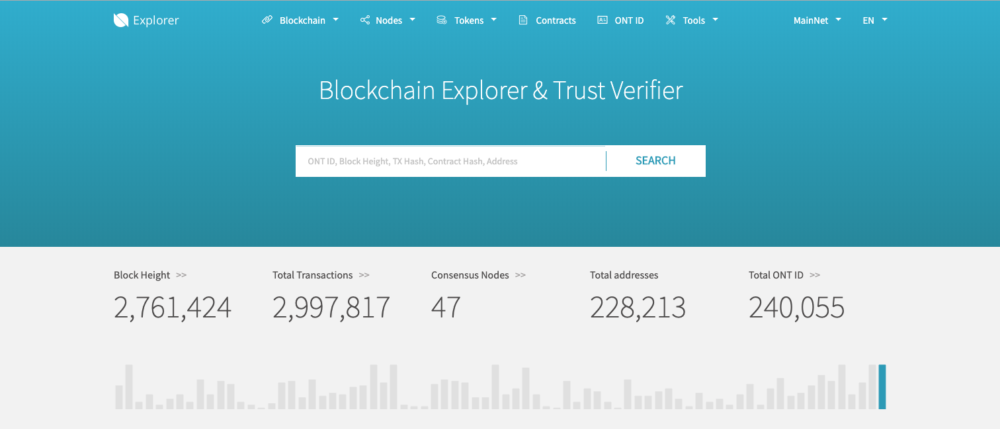
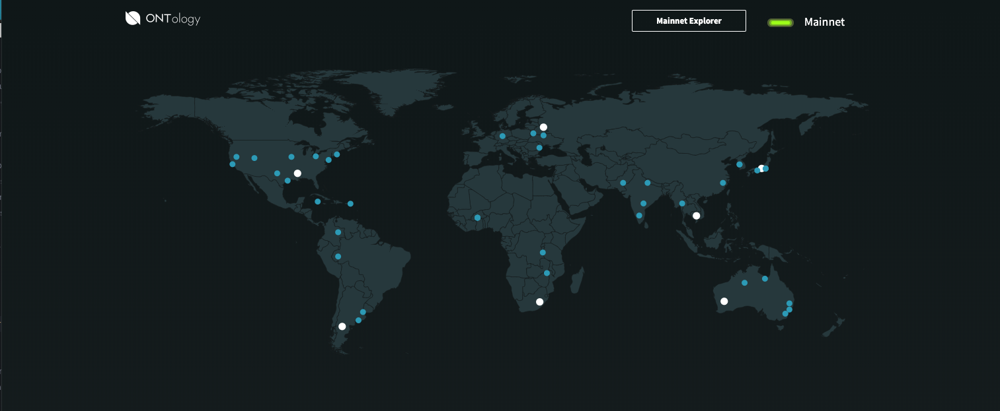
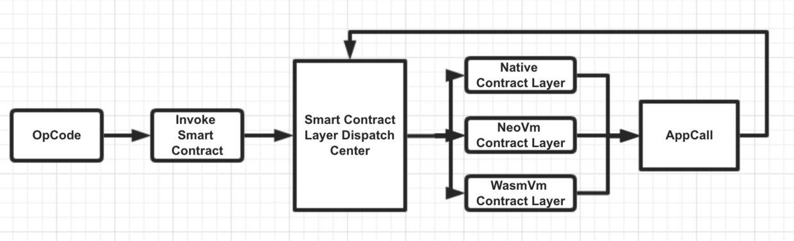

# Ontology Ecosystem Overview
Ontology is a high-performance blockchain project and distributed trust collaboration platform. Its quick block-times and ease of development make it a prime blockchain for developing applications that can be used to build transactions and move assets, verify identification and much more. This guide will walk you through building smart contracts that live on the blockchain, and building clients that interact with your custom smart contracts.

<iframe width="560" height="315" src="https://www.youtube.com/embed/JV-FQjbTYvw" frameborder="0" allow="accelerometer; autoplay; encrypted-media; gyroscope; picture-in-picture" allowfullscreen></iframe>   

## Ontology Team and Block Time
The Ontology Foundation is based in Shanghai, China and has over 90 core team members that focus on building and maintaining the underlying technology that runs the Ontology blockchain.

The consensus mechanism that the Ontology MainNet uses is [VBFT](https://dev-docs.ont.io/#/docs-en/DeveloperGuide/02-VBFT-introduction) (but it also supports DBFT with plans to include RBFT, SBFT and PoW). This translates to a 1 second block time. If there are no transactions, a new block will be generated every 30 seconds. [Here](https://explorer.ont.io/) you can explore the live MainNet — as you will notice, block time ranges based on the volume of transactions.

## Nodes  
There are 8 Consensus Nodes on the Ontology MainNet and 41 [Candidate Nodes](https://monitor.ont.io/).

### Consensus Node
The consensus network consists of all consensus nodes responsible for consensus on transaction requests within Ontology, block generation, maintaining the blockchain, and distributing consensus blocks to synchronous node networks.

### Candidate Node
The nodes in the candidate network do not participate in consensus but remain synchronized with the consensus network and update to the latest consensus block on the blockchain maintained by them in real time. Candidate networks will also monitor consensus network status, validate consensus blocks, and assist in managing the Ontology network.

## Smart Contracts  
Ontology Smart Contract currently supports three types of contracts: Native Contract, NeoVM Contract and WasmVM Smart Contract. 

### Native Contracts
Native Contracts are common contracts written directly on the underlying level of Ontology. Native contract services include the OntID contract, Auth contract, Ont contract, Ong contract and more.

### NeoVM Contracts
A NeoVM Contract is a contract you write that runs on the NeoVM virtual machine. Supported languages include: Python and C#.

Find out how to get started [here](../smartContract/gettingStarted.md).

### WasmVM Contracts
Wasm (WebAssembly) is a binary instruction format for stack-based virtual machines. Wasm is designed to be a portable target for compiling high-level languages such as C/C++/Rust, and supports deployment of client and server applications on the web. WasmVM is a high-performance and universal virtual machine.

## Connecting a Client
Ontology has developed a number of SDKs to help developers work with the Ontology Ecosystem across a range of languages, including: Java, Python, Swift, Kotlin, C# and others.

With each SDK you will be able to send transactions and move assets. Find the full list [here](https://dev-docs.ont.io/#/docs-en/SDKs/00-overview).

In addition, TowerBuilders created a Swift SDK that focuses on usability built off of the Ontology Go Implementation, available [here](../clientApp/ios.md).

Web Apps can connect through the Typescript SDK or through the dAPI created by TowerBuilders [here](../clientApp/web.md).
