# Deploying Smart Contracts

After you have finished writing and fully testing your smart contract in the SmartX web IDE, you are now ready to deploy your smart contract. There are several options available when deploying your smart contract, and each has it's own specific purpose.

## Available Networks Overview

### Private Net

A private instance of the Ontology blockchain, running locally on your computer. This should always be the very first place that you deploy your smart contract after running all your functions through the debugger in SmartX. Once deployed on your private network, you can start creating your client or server based application that will interact with your smart contract. The locally hosted private network has the same REST/RPC/Websocket interfaces available as the Ontology Test or Main net, and can be used and should be used whenever possible during the development phase. Only once you have fully built out and tested both your smart contract and client/server application against your contract deployed on your private network, should you start looking into deploying to the Ontology test network.

### Test Net

Since your private net is hosted on your local machine it makes it harder to share the beta version of your app, so this is when the Ontology hosted test network comes into the picture. The test network is a full featured version of the Ontology blockchain, which even has a fully hosted version of the web explorer. Test network ONT/ONG is provided via an automated system, and is only limited on a per address, per day basis. However, you can create as many new addresses as you required to deploy and test out your contract and application. Once you have completed testing with your team, and are ready to bring your application to the masses, it's time to deploy to the Ontology main net.

### Main Net

The production version of the Ontology blockchain is an open protocol on which any user is free to deploy their smart contract applications, as long as they pay the fee in ONG. A small to medium sized contract will roughly costs only 10 ONG to deploy, which makes it very easy for even individual project owners to get started. Once on deployed on the main net, your contract will be able to fully interact with the community of other hosted smart contracts and user accounts.

## Setting Up a Private Net

The ontology team has made it extremely simple for anyone to host their own private net by installing a single pre-packaged desktop application. The private net application is called Solo Chain, and it can be run without any environment setup or external dependencies to install. Simply download the Solo Chain application from the official repository on GitHub, and start the application.

Download the latest version of Solo Chain from the link below:
https://github.com/punicasuite/solo-chain/releases

Upon installation, open the Solo Chain application. You should now be on the `Accounts` tab of the application. Where there will be a single "master" account, which holds all the ONT for the network. Click on the `Redeem ONG` button just to the right of the main address to claim all the ONG for this account up to the current block.

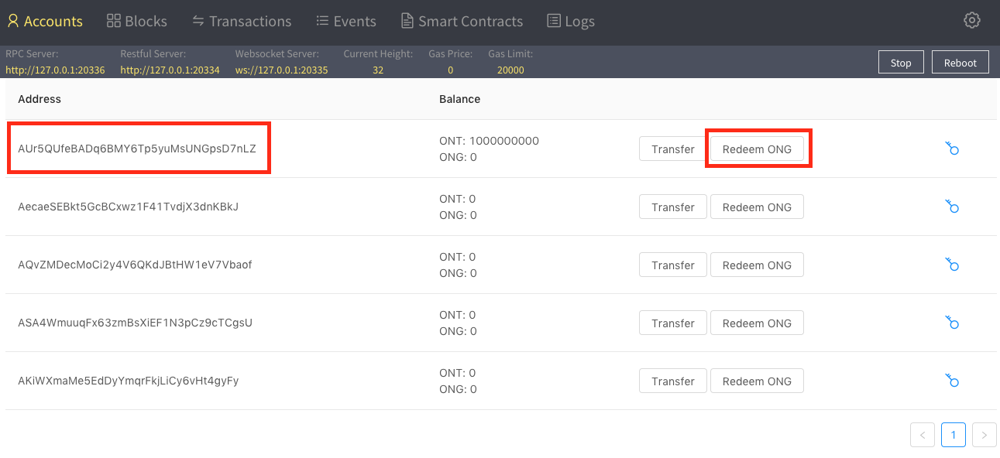

This is the account which you will be using to deploy your smart contract to the private net. Since it's private, you control all the ONG required to deploy your contracts and won't need to request any from any 3rd party.

Click on the key button to the right of the main account, and copy the value under the heading `WIF`. This is the private key of the main account that we will use to import it into your wallet in the next step.

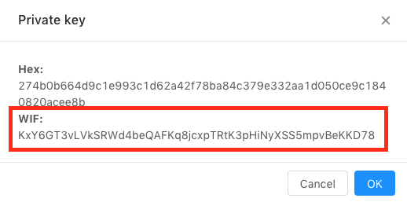

## Ontology Connected Wallet Setup

When deploying a smart contract to any network you will need a wallet application to interact with the Ontology blockchain. Currently there are 2 main wallets that can support your development, Cyano and O3. Since Cyano is directly integrated into SmartX, we will use this wallet to start.

The Cyano wallet is a chrome extension that supports Ontology, and is directly integration with the SmartX platform. If you don't already have it installed, you can get it directly from the Chrome extension store, or via direct download.

[Download Cyano Wallet](https://chrome.google.com/webstore/detail/cyano-wallet/dkdedlpgdmmkkfjabffeganieamfklkm?hl=en-US)

Upon opening up the Cyano wallet, click on the `IMPORT PRIVATE KEY` button. We will be importing the main account on your private net.

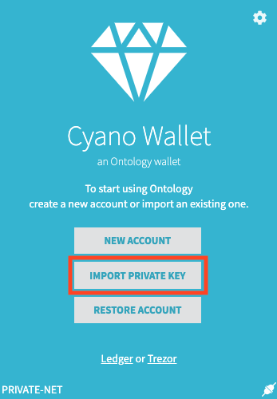

If you already have your Cyano wallet setup, you can add this account in the accounts screen which you can access via the arrow buttons at the top of the wallet.

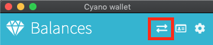

Paste the private key you copied from Solo Chain into the `Private key` input field, and set any password you can easily remember for this account.

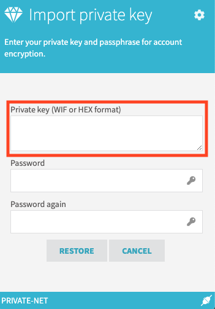

You should now be presented with your main Solo Chain account in your Cyano wallet.

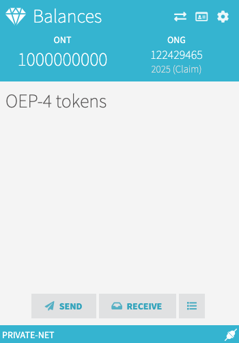

Navigate to the settings screen in the Cyano wallet, and change the `Net` value to `PRIVATE-NET`.

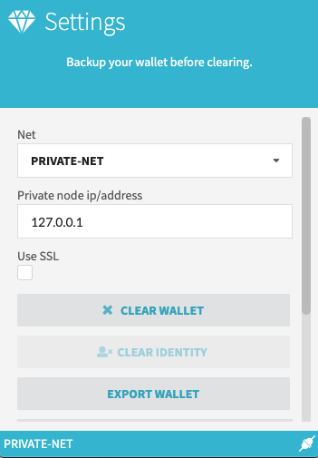

## Deploying To Private Net

Once you have your wallet all setup, navigate into the SmartX web IDE, and open one of your smart contracts. In this case, we have the hello world template contract open.

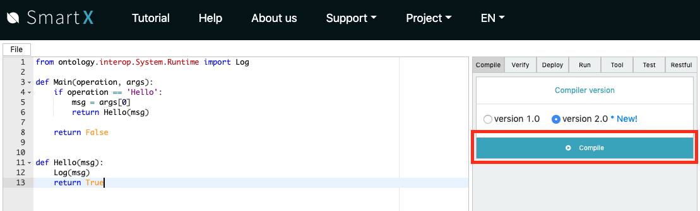

Click over to the `Deploy` tab on the right-hand side of the window.

Fill out some general information about your contract.

Then click the `Deploy` button at the bottom.

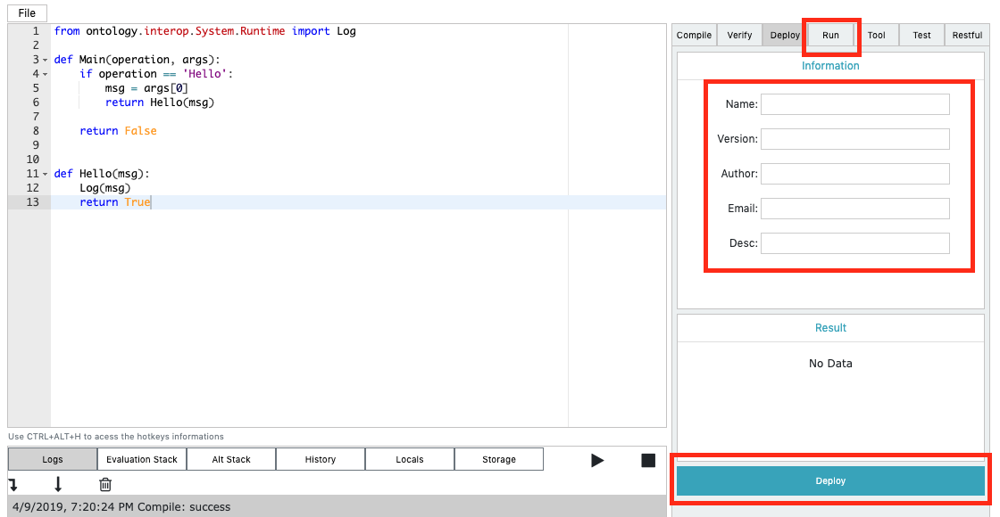

The Cyano wallet should pop up with a confirmation screen for the details of your smart contract. Review these details, and ensure that the wallet is set to private net at the bottom.

After reviewing the details, click `Confirm`.

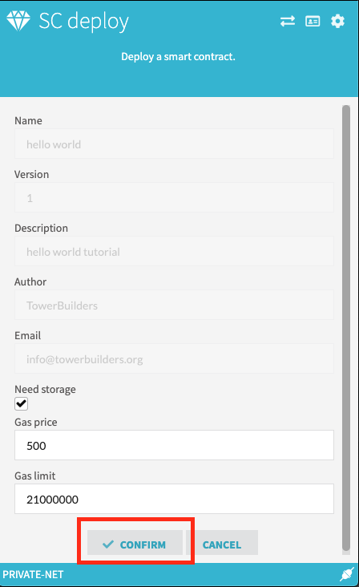

Enter the password you had set earlier for your wallet, and click confirm again.

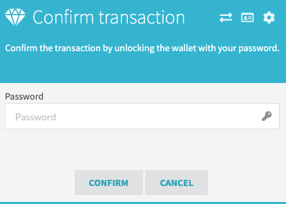

Back in SmartX, in the `Logs` section at the bottom, your should get a console log showing a JSON with a `SUCCESS` message.

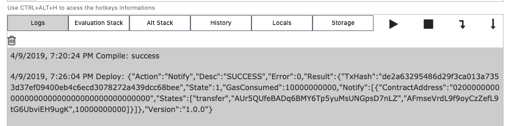

If you head over to Solo Chain, and click on the `Smart Contracts` tab at the top. You should now see your deployed smart contract in the list.

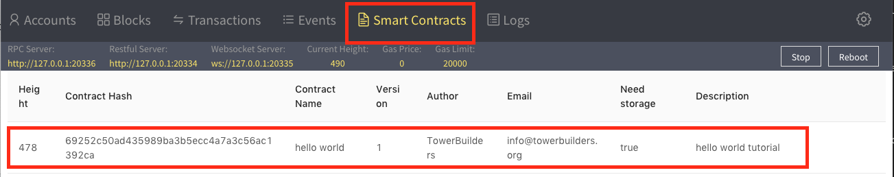

At this point, your smart contract is deployed to your private net, and is ready to be invoked.

## Testing Your Contract

Now that your contract is deployed on private net, you can start invoking it straight from SmartX. You can execute function in the `Run` tab, just as you did using `Debug Run`. However this time, you can use `Pre-Run` and `Run`. The difference being that `Pre-Run` will just perform a read invoke against the deployed contract. This will not require a signature from the Cyano wallet, will not write any data to contract storage, and will return you the result of the function called. The `Run` button will actually require your approval for the transaction in Cyano, and write any results to the blockchain (persisting any modifications to contract storage).

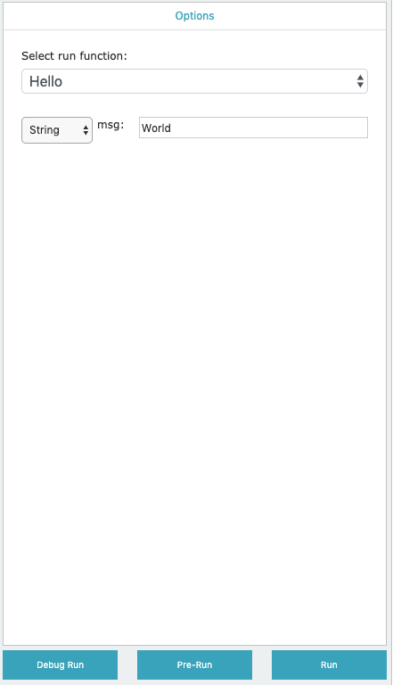

## Deploying to Test Net or Main Net

In order to deploy your contract to test net or main net, the procedure is basically the same, except that you will need to request test net ONG or have some main net ONG ready.

In the cyano wallet, in the settings screen, change the `Net` value to the desired network, and run through the deploy steps again in SmartX.

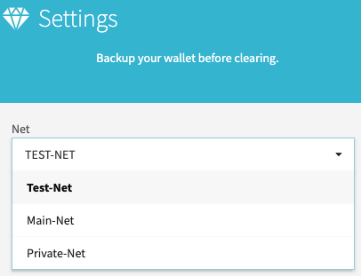

## Requesting Test Net ONG

If you are ready to deploy to test net to share your application with others, and need some ONG for the deployment, head over the the following page.

[https://developer.ont.io/applyOng](https://developer.ont.io/applyOng)

You are only allowed to use this page once per address, but it's not a big deal, as you can create as many new addresses as you require.
