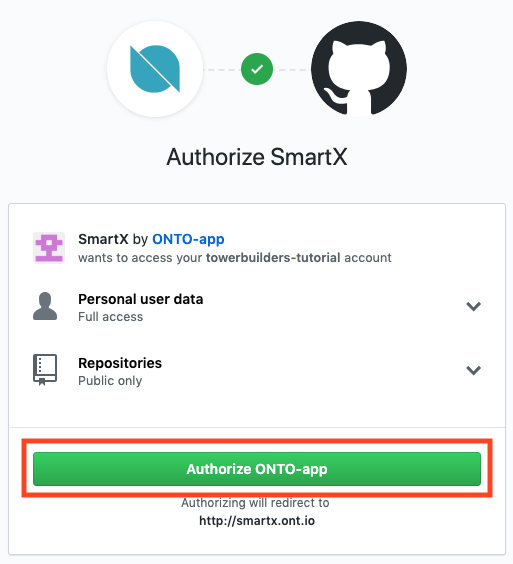
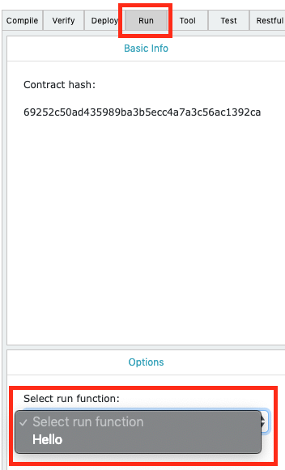

# Smart Contracts: Getting Started

This is an overview of how to get started writing Ontology smart contracts. When creating smart contracts on Ontology, there are a range of options for writing and deploying your code.

The Ontology platform has support for executing contract code on the neovm or wasmvm, where neovm contracts can be written in C# or Python, and C++ for wasmvm. In this tutorial, we will start with how to write neovm smart contracts using Python.

## Web IDE: SmartX

[https://smartx.ont.io](https://smartx.ont.io)

SmartX is a web based IDE created by Ontology which allows developers to get started creating and debugging smart contracts with no installations. The only thing you will need before getting started is a GitHub account.

### Creating an Account

On the SmartX login screen, click on the GitHub icon to login using your GitHub account.


Authorize the SmartX app to connect with your GitHub account.



### Hello World

Upon logging in, you will be presented with a list of your current projects, and given options to create a new project. If it is your first time logging in, your "My Project List" will be empty. Click on the "Create Project" button to get started creating your first smart contract.


SmartX supports creating projects with Python and C#. For the sake of this tutorial, we will be using Python, so click the "Python" button to continue.


There are a couple templates to choose from, so select "Hello World".

Name your contract. In this case I've called it "hello".

When you are finished, click the "Ok" button to create your contract.


You should now be presented with the template for your hello world smart contract.

Code example:
```python
from boa.interop.System.Runtime import Log

def Main(operation, args):
    if operation == 'Hello':
        msg = args[0]
        return Hello(msg)

    return False


def Hello(msg):
    Log(msg)
    return True
```

Most smart contract have a "Main" function, which serves as the entry point into your smart contract when invoked. The typical call signature for the main function takes two arguments, the "operation" and "args".

The first argument, "operation", denotes the function in your smart contract which you would like to invoke. In this example, the function we want to call is "Hello".

The second argument, "args", will be an array of arguments which you would like to pass to your function. In this example, the args array has a single element, which will be passed to the Hello function.

### Compiling

Smart contracts in the Ontology ecosystem are run on the neovm, which accepts a compiled version of your contract code in the form of a serialized bytearray. SmartX handles this compilation for you, and supports two versions of compilers, 1.0 & 2.0.

We will discuss the differences in a future tutorial, so for now, leave it set to compiler 2.0, and click the "Compile" button on the right-hand side.


Upon a successful compile, you should receive a log of, "Compile: success", found in the "Logs" section at the bottom left-hand of the screen. You will also see the script hash value of your contract in the "ABI" section. This will be the value you use to call your contract in the future.


### Running

Now that we have successfully compiled out smart contract, we can run it by calling the Hello function.

Navigate to the "Run" tab on the right-hand side.

Select the "Hello" function from the dropdown list. This will set the first argument of our Main function to "Hello".



The compiler has also detected that the Hello function takes a single argument, so we need to first select the data type of the arg we want to pass to the Hello function.

In this case we can select "String", and set the value of the arg to any string you want. Here I have just passed the string "world".


There are a few options to run the contract:

Debug Run - Execute the contract function locally.

Pre-Run - Test the execution of the contract function against a deployed contract. Will NOT write the result to the blockchain.

Run - Execute the contract function against a deployed contract. WILL write the result to the blockchain.

In this case, we will use "Debug Run" to execute our Hello function locally. After clicking "Debug Run", the results will show in the "Logs" section on the right-hand side.

As you can see from the result, our contract successfully logged our input value "world".


Congratulations, you have successfully run your first hello world smart contract with Ontology.
