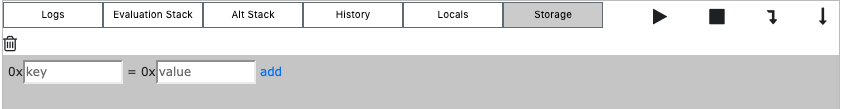
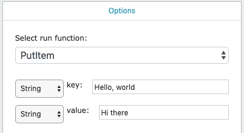
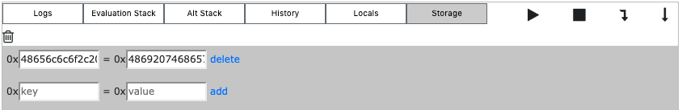
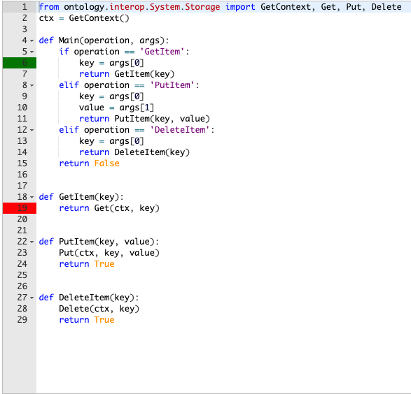

# Smart Contracts: Handling Data

This is an overview on handling data in Ontology smart contracts. It will go over all you need to know to master reading/writing data to a neoVM smart contract.

For this tutorial we will be continuing to use the SmartX IDE, writing in Python. We will be using the version 2.0 Python compiler.

## Introducing Storage

All neoVM smart contracts are able to keep track of data stored on the blockchain. This data is siloed off from other contracts and is specific to that contract. It can be written to and read from freely by anyone on the network. It is kept in storage.

We can add storage to smart contracts by adding the functions `GetContext`, `Get`, `Put` and `Delete` from `ontology.interop.System.Storage`.

`GetContext` gets the storage context for the smart contract, meaning it returns the value that needs to be written to and read from in order to keep track of data for a given smart contract. `Get` reads a value from a context for a given key. `Put` sets a value for a key in a context. `Delete` deletes a value for a key in a context.

## Storage Example

Let's take a look at an example contract:
``` python
from ontology.interop.System.Storage import GetContext, Get, Put, Delete
ctx = GetContext()

def Main(operation, args):
    if operation == 'GetItem':
        key = args[0]
        return GetItem(key)
    elif operation == 'PutItem':
        key = args[0]
        value = args[1]
        return PutItem(key, value)
    elif operation == 'DeleteItem':
        key = args[0]
        return DeleteItem(key)
    return False


def GetItem(key):
    return Get(ctx, key)


def PutItem(key, value):
    Put(ctx, key, value)
    return True


def DeleteItem(key):
    Delete(ctx, key)
    return True
```

In this contract we get the context of the contract at the top, we only need this value once. We then define three functions, `GetItem`, `PutItem` and `DeleteItem`. These functions simply wrap the `Get`, `Put` and `Delete` functions we imported at the top.

We can now store values in storage using `PutItem`, retrieve those values using `GetItem` and delete them from storage using `DeleteItem`.

### The Storage Debugger

SmartX offers a storage debugger that we can use to test out our contracts. Click the button labeled "Storage" at the bottom of the screen in SmartX to bring it up. It should look like this:



To the right of the screen we're going to go to the "Run" tab and go to "Select run function" and choose `PutItem` from the dropdown list. For key we'll put the string `Hello, world` and for value the string `Hi there`. It should look like:



Next we'll click "Debug Run" at the bottom of the screen and we'll immediately see that the storage debugger has updated!



Now switch the selected function to `GetItem`, click "Debug Run" (make sure that the key is still `Hello, world`) and click on "Logs" at the bottom and we'll see:


Lastly, if we switch the function to `DeleteItem`, click "Debug Run" (make sure that the key is still `Hello, world`) and then run `GetItem` again, we'll see:


### Breakpoints

You can also use breakpoints to debug a smart contract. Simply click to the left of the line and it will appear red. When you run "Debug Run", a hit breakpoint will turn green and non-hit breakpoints will remain red. For example, using our smart contract from above:


## Advanced Usage

There are two more important things you need to understand about using storage in smart contracts.

### Serialization

First, storage is not able to store objects in their normal form. If you want to store an array or a dictionary you will need to serialize them before putting them into storage and then Deserialize them after retrieving them. Check out this modified version of the previous contract:

``` python
from ontology.interop.System.Storage import GetContext, Get, Put, Delete
from ontology.interop.System.Runtime import Serialize, Deserialize
ctx = GetContext()

def Main(operation, args):
    if operation == 'GetItem':
        key = args[0]
        return GetItem(key)
    elif operation == 'PutItem':
        key = args[0]
        value = args[1]
        return PutItem(key, value)
    elif operation == 'DeleteItem':
        key = args[0]
        return DeleteItem(key)
    return False


def GetItem(key):
    value = Get(ctx, key)
    if value is None:
        return None
    deserialized = Deserialize(value)
    return deserialized


def PutItem(key, value):
    serialized = Serialize(value)
    Put(ctx, key, serialized)
    return True


def DeleteItem(key):
    Delete(ctx, key)
    return True
```

In this example we are using `Serialize` in `PutItem` and `Deserialize` in `GetItem`. Note that we do not attempt to `Deserialize` the value when it is `None`.

### Input/Output

The `Main` function takes two parameters - the first is the operation and the second is a list of arguments. The operation name is always a string and the arguments is an array that can contain all kinds of types, such as strings, integers, byte arrays, arrays (of strings, integers, etc), dictionaries and booleans.

Note that smart contracts do not work with floating point numbers. A common practice is to multiply a number by `10^x`, where x is the amount of decimals you want. For example if storing up to three decimals you would use `25` to represent `0.025` as it is equal to `0.025 * 1000`.

You cannot return dictionaries and arrays from a smart contract. The `GetItem` function here will work when using "Debug Run" in SmartX but will not actually work if deployed to the blockchain. You can either rework how you are storing information or returned the serialized version of the object and deserialize it off chain in the client.
